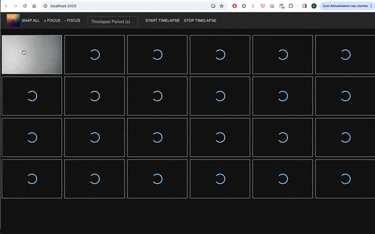

# Omniscope Mutliviewer for the Browser

##### Install:
in your terminal, write 

```
npm install
```

for the Omniscope APP 

```
cd 

```

## Showcase



## For the raspberry pi

```bash
sudo apt update
sudo apt upgrade

sudo apt install -y ca-certificates curl GnuPG
curl -fsSL https://deb.nodesource.com/gpgkey/nodesource-repo.gpg.key | sudo gpg --dearmor -o /usr/share/keyrings/nodesource.gpg
NODE_MAJOR=18
echo "deb [signed-by=/usr/share/keyrings/nodesource.gpg] https://deb.nodesource.com/node_$NODE_MAJOR.x nodistro main" | sudo tee /etc/apt/sources.list.d/nodesource.list
sudo apt update
sudo apt install nodejs
node -v
```

```bash
git clone https://github.com/Matchboxscope/Omniscope-MultiCamViewer
cd Omniscope-MultiCamViewer/server
npm install
npm run
```

```bash
cd Omniscope-MultiCamViewer/client
npm install
npm run
```

## Electron

```bash
cd electron
npm run electron-start
````
``
```bash
npm install --save-dev electron-builder
npm run dist -- -w
npm run dist -- -m
```